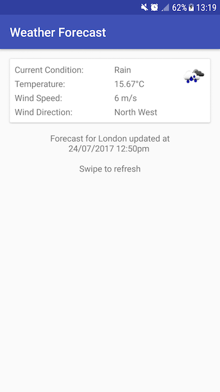

# WeatherForecast
Code Sample using MVP

This is a simple code that implements the following logic:

If the user is online:
  - Shows the current weather information
  - If there's any problem retrieving the data the last known weather will be displayed with the out of date message.

If the user is offline:
  - Cached request for max 24h (with a message to let the user know it's out of date)
  - If the cached information is >24h don't display any weather information once the information should not be pertinent any more and display a empty screen with a button to retry.
  
Weather information source: OpenWeatherMap.org

# Libraries
- Google Play Services - Location: Used to get the last known location using a standard tool
- Retrofit - Rest service framework
- Gson Converter - Easily populate the JSON response into a Java class
- OkHttp - Rest Client for Retrofit (used here for adding a interceptor for caching)
- OkHttpLoggingInterceptor - Used to log the server connection, mainly used for debug so only logging if is on BuildConfig.DEBUG
- Glide - Image controller

